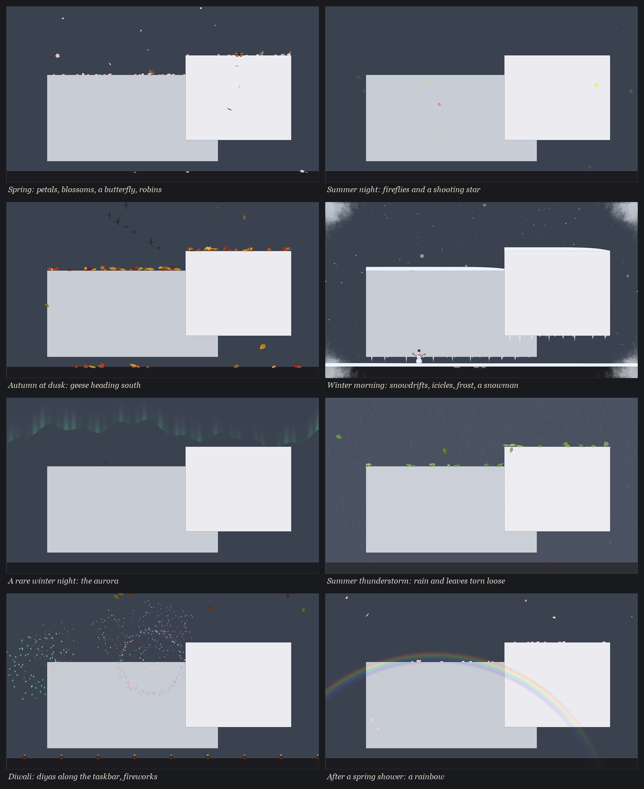

# Autumn

A whole year that lives on your Windows desktop. Leaves, petals, snow, and rain fall across the
screen and settle on the top edges of your real windows and on the taskbar. The seasons, the time of
day, and the weather follow your calendar and clock, and the desktop remembers everything between
runs.

It's one 270 KB program with no image or sound files and no dependencies, and it's completely
offline. It never reads what's on your screen, only where your windows are.



*Offscreen renders of the real code. The grey boxes stand in for windows.*

## Build and run

You need Windows 10 or 11 and nothing else. The build uses the C# compiler that ships inside
Windows. In the repo folder, run:

```
powershell -ExecutionPolicy Bypass -File build.ps1
```

That makes `Autumn.exe`. Run it and the leaves start falling. Its menu is the maple leaf in the
notification area.

## The year

| | |
|---|---|
| **Spring** | Cherry petals and whole blossoms, April showers, butterflies, a dawn chorus of birdsong |
| **Summer** | Green leaves torn loose in thunderstorms, fireflies and crickets on warm nights |
| **Autumn** | Maple, oak, birch, and ginkgo leaves, gusts, rain, migrating geese, owls after dark |
| **Winter** | Snowfall that builds real snowdrifts, blizzards, icicles, frost on cold mornings, the rare aurora |

- **Seasons** follow the astronomical calendar. The hemisphere is guessed from the Windows time zone.
- **Day and night** come from the real position of the sun for roughly where you are, again guessed
  from the time zone. Everything takes on a golden light at sunrise and sunset and turns moonlit
  blue at night. The moon's phase is real too.
- **Weather** changes on its own every few minutes, with odds that depend on the season: clear,
  breezy, rain, thunderstorms, snow, and blizzards. Rain splashes on ledges, and wet window corners
  keep dripping after the shower stops. Lightning is a soft flash with a forked bolt, and the
  thunder arrives a few seconds later. Snow drifts deeper on the downwind side. Snow melts when it
  warms up.
- **Crickets** chirp faster on warmer nights, following Dolbear's law.

## Things to try

- **Drag a window slowly.** Its leaves and snow ride along with it. **Shake it** and they fly off.
  If it has icicles, they snap off and shatter.
- **Sweep the mouse fast** through a pile to kick it up. You'll hear a crunch. Sweep through snow
  to plow it.
- **Click a falling leaf** to catch it. Let go and it flutters away. The click still reaches the
  window underneath, so nothing breaks.
- **Hold the pointer still** for a moment. A leaf might land on it, snow might pile up on it, or a
  butterfly might perch there. On summer nights, fireflies gather around it.
- **Approach a perched bird slowly.** Move fast and it flies off.
- **Draw a quick circle with the mouse.** Try it.
- **On a frosty winter morning,** move the pointer over the frost to wipe it off.

## Controls

Right-click the maple leaf in the notification area. From there you can:

- open the **Almanac**
- preview any **Season**, **Weather**, or **Time of day**
- summon a gust
- choose more or fewer leaves
- set the sound to off, quiet, or full
- pause
- choose **Let it end**, which blows everything away and exits

Double-click the leaf to open the Almanac.

The **Almanac** is a small book about your desktop's year:

- today's sky: sunrise and sunset, the moon, the next meteor shower
- your tallies of leaves, snowflakes, birds, lightning, and more
- a journal of moments
- the **secrets** you've found, with hints for the rest

Sound is synthesized live and mixed by a small built-in audio engine. It goes quiet when you step
away from the computer, and it closes the audio device when it's silent, so it never keeps the PC
awake. Everything hides during fullscreen video, presentations, and games, and while the PC is
locked. On battery it runs at 30 fps.

```
Autumn.exe          start it (if it's already running, this summons a gust)
Autumn.exe --stop   end it with the farewell gust
```

Your year is saved in `%APPDATA%\Autumn\almanac.txt`: tallies, secrets, the journal, the leaves
and snow on your taskbar, and your settings. Nothing runs at login. To remove everything, delete
this folder and that one.

## How it works

- **Windows.** Each frame, `EnumWindows` and DWM's visible frame bounds list every top-level
  window in z-order. The visible stretches of their top edges become ledges. Window motion is
  smoothed, so gentle drags carry what's on a ledge and shakes throw it.
- **Rendering.** There is one click-through, per-pixel-alpha layered window per monitor.
  Everything is drawn by a hand-written blitter straight into a premultiplied DIB:
  - bilinear affine sprites, with light tinting and additive glow
  - anti-aliased lines and gradient columns
  - dirty pixels gathered on a tile grid and uploaded with `UpdateLayeredWindowIndirect`
  - frames paced to vblank with `DwmFlush`
- **Art.** Everything is drawn from geometry and code: polar keyframes for maples, serrated
  profiles, five-petal blossoms, birds, butterflies, geese seen from below, a snowman, diyas, fern
  frost, and dendrite snowflakes.
- **Sound.** A `waveOut` streaming mixer on its own thread. Rain, wind, crickets, and fire
  crackle are continuous generators. Crunches, thunder, birdsong, owls, geese, chimes, fireworks,
  and breaking ice are one-shots synthesized from noise, sines, envelopes, and filters.
- **Sky.** Low-precision solar position, mean lunation, a temperate climate curve, and a
  Markov chain for the weather.

<details>
<summary>Spoilers: every secret and how to preview it</summary>

There are 21 secrets. Hints are in the Almanac. To force an event on a running instance:

```
Autumn.exe --set season=winter weather=blizzard hour=23
Autumn.exe --set event=aurora        (also: meteor, rainbow, lightning, geese, birds, butterfly,
                                      monarchs, fireflies, whirlwind, heart, snowman, icicles,
                                      frost, diwali, newyear, halloween, christmas, away, year)
Autumn.exe --set season=follow weather=auto hour=real
```

Some things only happen on real dates:

- meteor showers: the Perseids, Orionids, Geminids, and others
- Diwali, on the new moon of Kartika, if you're in India, Nepal, or Sri Lanka
- New Year's midnight
- Halloween dusk
- Christmas
- the solstices and equinoxes

Find eight secrets and the Almanac lets you wind the whole year past in a minute.
</details>

## License

MIT. See [LICENSE](LICENSE).
